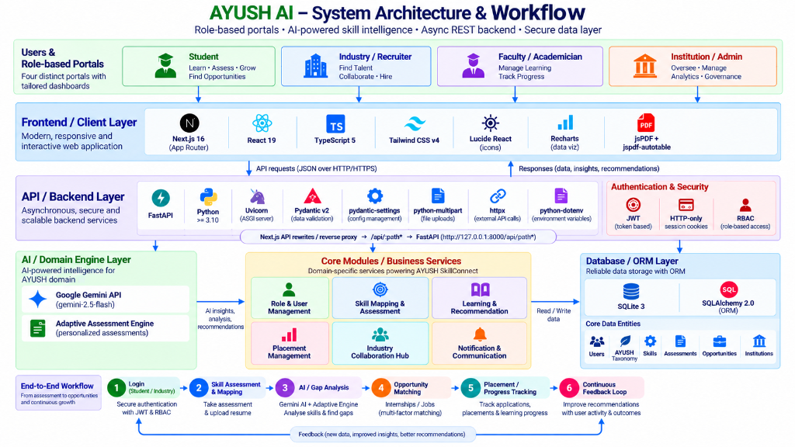
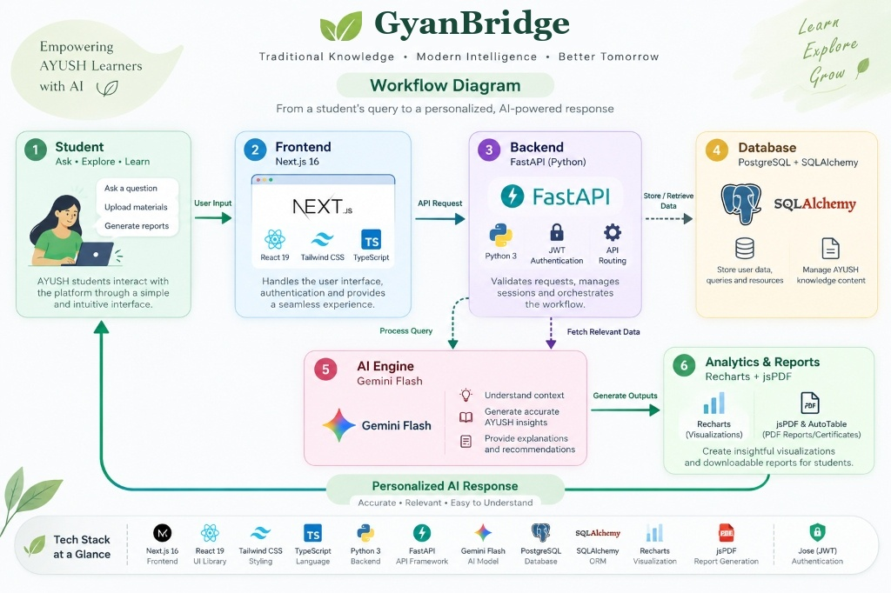
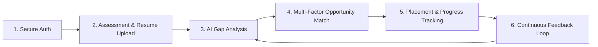

# 🌿 GyanBridge — Skill Intelligence & Academia–Industry Collaboration Platform

> **Traditional Knowledge • Modern Intelligence • Better Tomorrow**  
> *A unified skill intelligence layer, adaptive clinical assessment engine, role-specific skill gap analyzer, and explainable opportunity matching ecosystem built for the Ministry of Ayush.*

---

## 📌 Executive Summary

**GyanBridge** bridges the critical gap between traditional AYUSH education (Ayurveda, Yoga & Naturopathy, Unani, Siddha, Sowa-Rigpa, and Homeopathy) and the modern bio-pharmaceutical, healthcare, and research industries. 

By integrating **Google Gemini 2.5 Flash** with authoritative statutory pharmacopoeial standards (*Schedule T, Schedule Y, AYUSH-GCP, CTRI, and the Ayurvedic Pharmacopoeia of India*), the platform provides real-time skill benchmarking, multi-factor job/internship matching with **zero artificial inflation**, adaptive clinical assessments, and institutional analytics across four dedicated user portals.

---

## 🗺️ System Architecture & Workflow

### 1. End-to-End System Architecture & Layered Workflow


### 2. Student Query-to-Response AI Workflow


---

## 🔄 End-to-End Platform Lifecycle



1. **Secure Authentication & RBAC:** Single entry point for Students, Industry Recruiters, Academicians/Faculty, and Institutional Administrators.
2. **Skill Assessment & Profile Extraction:** Real-time resume extraction (PDF/Word) combined with adaptive clinical assessments mapped to national benchmarks.
3. **AI & Gap Analysis:** Gemini 2.5 Flash paired with deterministic domain engines identifies missing mandatory competencies against target industry roles.
4. **Explainable Opportunity Matching:** Algorithmic ranking connecting qualified candidates to internships, research fellowships, and clinical trials.
5. **Placement & Progress Tracking:** End-to-end management of interviews, mentorship sessions, course completion, and credential issuance.
6. **Continuous Feedback Loop:** Outcome data feeds back into the recommendation models to keep AYUSH curricula aligned with shifting market demands.

---

## 👥 Role-Based Portals & Key Features

### 🎓 1. Student Portal
- **Career Role Target Benchmarking:** Select target career roles (e.g., *Clinical Trial Coordinator, Ayurvedic Pharmacovigilance Officer, Herbal Drug Formulation Scientist*) and view real-time readiness scores.
- **Smart AI Resume Parser:** Drag-and-drop PDF/DOCX parser that automatically detects AYUSH regulatory keywords (*CTRI, Schedule Y, HPTLC, GCP*) and maps them directly to the skill taxonomy.
- **Adaptive Clinical Assessments:** Multi-difficulty test runner featuring situational clinical judgment scenarios, statutory compliance questions, and instant explanations.
- **Personalized Learning Recommendations:** Automated curated roadmaps of specialized training modules to bridge identified skill gaps.
- **Downloadable Verified Audit Reports:** Export comprehensive, tamper-evident AYUSH Skill Readiness and Assessment scorecards in PDF via `jsPDF`.
- **Mentorship Hub:** Connect with verified industry experts and senior academic faculty.

### 🏢 2. Industry & Recruiter Portal
- **Zero-Inflation Talent Matching:** Multi-dimensional match scoring (Technical Skills 50%, Education 15%, Discipline 10%, Sector Fit 10%, Projects 5%, Certifications 5%, Location 5%). Missing mandatory prerequisites severely gatekeep suitability to eliminate inflated scores.
- **Opportunity Pipeline:** Post clinical trial openings, R&D internships, and production roles with required vs. preferred skill weighting.
- **Candidate Pool Discovery:** Filter candidates by validated clinical competency scores rather than unverified self-reported claims.
- **Industry Feedback Mechanism:** Submit structured feedback on candidate preparedness to help academic institutions calibrate curricula.

### 👨‍🏫 3. Faculty & Academician Portal
- **Curriculum Alignment Analytics:** Compare student cohort performance against current industry demands to identify syllabus gaps.
- **Mentorship Request Management:** Review, accept, and conduct 1-on-1 mentorship sessions with aspiring researchers and practitioners.
- **Student Progress Monitoring:** Track cohort readiness across various AYUSH specializations (*Dravyaguna, Rasashastra, Panchakarma, Phytochemistry*).

### 🏛️ 4. Institution & Admin Portal
- **Macro Institutional Analytics:** Campus-wide skill distribution, role readiness distributions, and cohort benchmarking.
- **Placement & Industry Collaboration Hub:** Manage Memorandums of Understanding (MoUs), campus recruitment drives, and employer relationships.
- **Accreditation Readiness:** Generate institutional audit logs for regulatory compliance and accreditation bodies (e.g., NCISM, NCH, NAAC).

---

## 💻 Comprehensive Technology Stack

| Layer | Technology | Version | Description & Role |
| :--- | :--- | :--- | :--- |
| **Frontend Framework** | **Next.js** (App Router) | `16.3.4` | Server Components, Client Components, dynamic routing, and API proxy rewrites. |
| **UI Library** | **React** / **React DOM** | `19.2.8` | Component rendering, state hooks, and modern concurrent features. |
| **Language (Client)** | **TypeScript** | `^5.0.0` | Strict static type definitions across all props, state, and API contracts. |
| **Styling & Design** | **Tailwind CSS v4** | `^4.0.0` | `@tailwindcss/postcss` v4 with custom enterprise tokens (*Cohere 2026 + AYUSH Emerald*). |
| **Icons** | **Lucide React** | `^1.40.0` | Consistent iconography across navigation, badges, and dashboard widgets. |
| **Data Visualization** | **Recharts** | `^3.10.1` | Interactive radar charts, skill gap bars, readiness rings, and historical trend lines. |
| **PDF Generation** | **jsPDF** & **jspdf-autotable** | `^4.2.1` / `^5.0.8` | Client-side export of official AYUSH Readiness Certificates and Scorecards. |
| **Micro-Animations** | **canvas-confetti** | `^1.9.4` | Milestone celebration effects for test completions and job applications. |
| **Client Auth / JWT** | **jose** | `^6.2.10` | Edge-compatible JWT signing and verification with secure HTTP-only cookies. |
| **Backend Framework** | **FastAPI** | `>= 0.115.0` | High-performance async Python REST API with auto-generated Swagger/OpenAPI docs. |
| **ASGI Server** | **Uvicorn** `[standard]` | `>= 0.30.0` | Asynchronous production web server running the Python event loop. |
| **Data Validation** | **Pydantic v2** | `>= 2.8.0` | Schema validation and serialization for requests and responses. |
| **Configuration** | **pydantic-settings** | `>= 2.4.0` | Type-safe environment variable parsing from `.env`. |
| **Password Security** | **passlib[bcrypt]** | `>= 1.7.4` | Salted password hashing and authentication guards. |
| **Token Auth (API)** | **python-jose[cryptography]**| `>= 3.3.0` | Bearer JWT generation, decoding, and cryptographic verification (HS256). |
| **Document Processing**| **pypdf** & **python-docx** | `>= 5.0.0` / `>= 1.1.0` | Extraction of text, structures, and multi-column tables from resumes. |
| **Async HTTP Client** | **httpx** | `>= 0.27.0` | Non-blocking HTTP client for external AI calls and in-memory ASGI test transport. |
| **Database** | **SQLite 3** | Built-in | Fast, zero-config relational storage (`data/ayush_platform.db`). |
| **Database ORM** | **SQLAlchemy 2.0** | `>= 2.0.30` | Async declarative models, session makers, and eager relationship loading. |
| **Async DB Driver** | **aiosqlite** | `>= 0.20.0` | Async SQLite driver keeping FastAPI event loop free of blocking I/O. |
| **AI / LLM Model** | **Google Gemini 2.5 Flash**| `v1beta` | Generates dynamic assessment questions, resume insights, and custom roadmaps. |
| **Fallback AI Engine** | **Deterministic Rules Engine**| Custom | Zero-downtime statutory rule-checker based on *Schedule T/Y* and *AYUSH-GCP*. |

---

## ⚡ Quick Start Guide (Windows)

The platform includes automated Windows batch scripts for one-click setup, execution, and cleanup:

### Option A: One-Click Automated Scripts (Recommended)

1. **System Setup & Verification:**
   Run [`Setup.bat`](file:///c:/Users/kundu/OneDrive/Desktop/AYUSH_AI_Final/Setup.bat) to automatically verify Python & Node.js, create the Python virtual environment, install dependencies, seed the canonical AYUSH database, and run the smoke test suite:
   ```cmd
   Setup.bat
   ```

2. **Start the Entire Application:**
   Run [`Start.bat`](file:///c:/Users/kundu/OneDrive/Desktop/AYUSH_AI_Final/Start.bat) to free up required ports, launch the FastAPI Backend (`:8000`), launch the Next.js Frontend (`:3000`), and automatically open your default browser:
   ```cmd
   Start.bat
   ```

3. **Stop All Services:**
   Run [`Stop.bat`](file:///c:/Users/kundu/OneDrive/Desktop/AYUSH_AI_Final/Stop.bat) anytime to cleanly terminate all background server processes on ports 8000 and 3000:
   ```cmd
   Stop.bat
   ```

4. **Reset Database:**
   To wipe data and restore the canonical AYUSH taxonomy and demo profiles:
   ```cmd
   ResetDB.bat
   ```

---

### Option B: Manual Setup

#### 1. Backend Setup
```bash
cd backend

# Create and activate Python virtual environment
python -m venv .venv
.venv\Scripts\activate       # On Windows
# source .venv/bin/activate  # On Linux/macOS

# Install dependencies
pip install --upgrade pip
pip install -r requirements.txt

# Configure environment variables
copy .env.example .env

# Initialize and seed database
python reset_db.py

# Launch FastAPI server
uvicorn app.main:app --reload --port 8000 --host 127.0.0.1
```

#### 2. Frontend Setup
```bash
cd frontend

# Install Node packages
npm install

# Configure environment variables
copy .env.example .env

# Launch Next.js development server
npm run dev
```

Visit **`http://localhost:3000`** in your browser.

---

## ⚙️ Environment Configuration

### Backend (`backend/.env`)
```env
PROJECT_NAME="GyanBridge Skill Intelligence API"
VERSION="1.0.0"
API_V1_STR="/api"

# Security Secret Key (must match JWT_SECRET in frontend/.env)
SECRET_KEY="ayush_sih26044_secret_key_2026_super_secure"
ALGORITHM="HS256"
ACCESS_TOKEN_EXPIRE_MINUTES=10080

# AI / LLM Integration (Google Gemini 2.5 Flash)
GEMINI_API_KEY="your_gemini_api_key_here"
```

### Frontend (`frontend/.env`)
```env
JWT_SECRET="ayush_sih26044_secret_key_2026_super_secure"
NEXT_PUBLIC_APP_URL="http://localhost:3000"
NEXT_PUBLIC_API_URL="http://127.0.0.1:8000/api"
```

> **Note on AI Keys:** If `GEMINI_API_KEY` is not provided or runs out of quota, the platform's **Graceful Fallback Engine** automatically takes over. It uses built-in pharmacopoeial databases and statutory rules to evaluate assessments and resumes with **100% uptime**.

---

## 🔑 Pre-Configured Demo Accounts

For rapid evaluation and demonstration, the platform includes instant one-click demo logins on the `/login` page, or you can use these seeded credentials:

| Role | Email | Password | Description |
| :--- | :--- | :--- | :--- |
| **Student** (Profile A) | `ayush.sharma@gyanbridge.gov.in` | `Demo@12345` | BAMS Graduate targeting *Clinical Research Associate*. |
| **Student** (Profile B) | `fresh.student@gyanbridge.gov.in` | `Demo@12345` | Fresh AYUSH Scholar exploring career roles. |
| **Industry** | `recruiter@dabur-research.com` | `Demo@12345` | Dabur R&D Talent Acquisition Lead. |
| **Faculty** | `faculty.tripathi@aiia.gov.in` | `Demo@12345` | Professor at All India Institute of Ayurveda. |
| **Institution** | `admin@aiia.gov.in` | `Demo@12345` | AIIA Institutional Placement & Academic Dean. |

---

## 🧪 Testing & Quality Assurance

The backend includes a comprehensive, asynchronous smoke test suite running against real in-memory ASGI transport:

```bash
cd backend
.venv\Scripts\python.exe test_smoke.py
```

### What the test suite validates:
1. **API Health & Database Connectivity:** Verifies database initialization and table schemas.
2. **Multi-Role Authentication:** Validates password hashing, JWT creation, and role guards.
3. **Dashboard KPI Aggregation:** Tests real-time recalculation of readiness scores and skill counts.
4. **Career Target Selection:** Asserts instant recalculation of role-specific deltas.
5. **Resume Parsing & NLP Engine:** Tests text and keyword extraction from clinical resumes.
6. **Adaptive Assessment Engine:** Simulates question generation, candidate responses, and statutory compliance grading.
7. **Multi-Factor Matching Engine:** Validates that candidate matching enforces mandatory skill gatekeeping with zero score inflation.

---

## 📖 Interactive API Documentation

When the backend is running, access the interactive OpenAPI documentation:
- **Swagger UI:** [http://127.0.0.1:8000/docs](http://127.0.0.1:8000/docs)
- **ReDoc:** [http://127.0.0.1:8000/redoc](http://127.0.0.1:8000/redoc)

---

## 📜 Regulatory Standards & Benchmarks Integrated

- **AYUSH-GCP Section 4.2 & Schedule Y:** Clinical trial safety, ethics committee oversight, and Serious Adverse Event (SAE) reporting protocols.
- **Ayurvedic Pharmacopoeia of India (API) Part I, Vol V:** Heavy metal limits (Pb $\le$ 10 ppm, As $\le$ 3 ppm), physicochemical assay standards, and HPTLC fingerprinting.
- **Schedule T (Good Manufacturing Practices - GMP):** Standardized batch manufacturing records, in-process microbial limits, and stability testing protocols.
- **NABH & Classical Ayurvedic Clinical Protocols:** Prakriti evaluation, pulse diagnosis diagnostics, and Panchakarma detoxification contraindications.

---

## 📄 License & Attribution
Developed for the **Ministry of Ayush** (Smart India Hackathon Problem Statement #26044). Built with modern full-stack web technologies and artificial intelligence.
